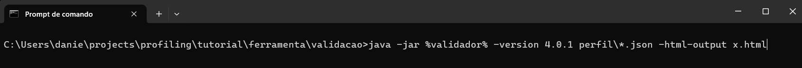
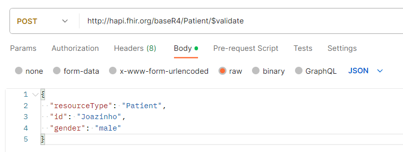
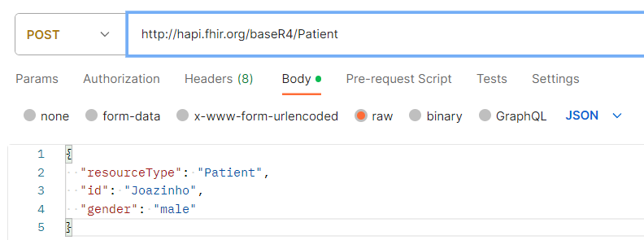

# Validação
## Insumos
### Validador CLI
Baixar [validador](https://github.com/hapifhir/org.hl7.fhir.validator-wrapper/releases/tag/1.0.40).

Comando: 

`java -jar validator_cli.jar arquivoFHIR1.json arquivoFHIR2.json`

Flags: 

- Versão: `-version 4.0.1` | Definir a versão do FHIR usada
- Gerar página HTML: `-html-output x.html` | Gera arquivo html com as explanações a respeito da validação.

Exemplo:

No exemplo, **%validador%** é uma variável de ambiente que tem o caminho do arquivo validator_cli.jar. Além disso, **perfil\\*.json** representa todos os arquivos json do diretório perfil. Por fim, é solictado que que seja gerado o html com as informação da validação no arquivo **x.html**.

## Servidor FHIR
Selecione um servidor FHIR que implemente as funcionalidades usadas, como por exemplo o http://hapi.fhir.org/baseR4 que é um servidor público.

### Para validar uma instância:
- Operação: POST
- Body: instância a ser validada
- URL: {base}/{resourceType}/$validate

{base}: a base da API do servidor escolhido.  
{resourceType}: o tipo de instância a ser validada.

Exemplo:

### Para inserir uma instância:
- Operação: POST
- Body: instância a ser inserida
- URL: {base}/{resourceType}

{base}: a base da API do servidor escolhido.   
{resourceType}: o tipo de instância a ser inserida.

Exemplo:

## Exemplos de uso
- Validação de uma instância simples em [simples](simples)
- Validação de uma instância de um perfil perfil em [perfil](perfil)
- Validação de um perfil com CodeSystem e ValueSet externos em [terminologiaExterna](terminologiaExterna)
